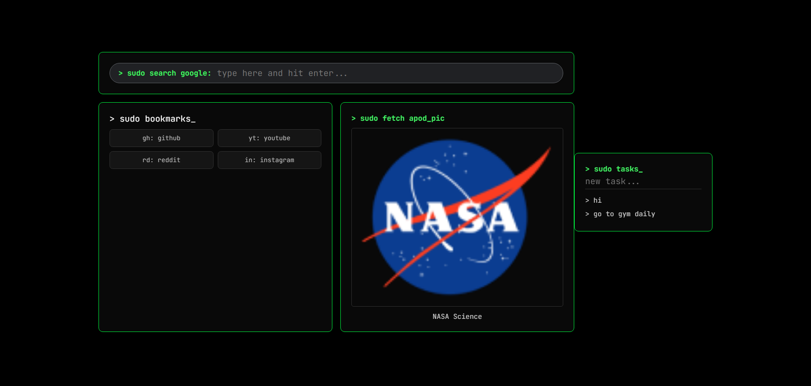

# sudo space

A simple, terminal-styled new tab page .

It combines some cool tools  search, bookmarks a local to-do list and NASA's Astronomy Picture of the Day.


## Preview




## Links

- Live Demo: 


## Features

- Google Search: Dark pill input that redirects queries straight to Google.
- NASA APOD Widget: Displays NASA's daily media image or embedded video .
- Tasks: Saves items to localStorage so they persist across tabs. Click any task to delete it.
- Bookmarks: Quick shortcuts to GitHub, YouTube, Reddit and Instagram.
- used Vanilla Stack: HTML, CSS and JavaScript bundled with Vite.
- API: [NASA APOD API](https://api.nasa.gov) (Astronomy Picture of the Day)


## Run Locally

1. Clone the repository and enter the directory:
```bash
git clone [https://github.com/Sooraj44882/sudo-space.git](https://github.com/Sooraj44882/sudo-space.git)
cd sudo-space
```

2. Install dependencies:
```bash
npm install
```

3. Generate a free API key at [https://api.nasa.gov](https://api.nasa.gov) and save it in a `.env` file:
```env
VITE_NASA_API_KEY=your_key_here
```

4. Run the development server:
```bash
npm run dev
```